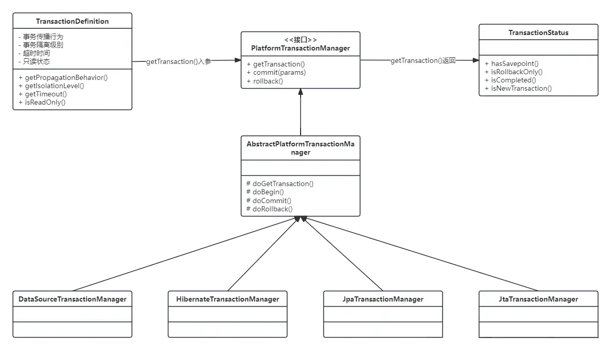

## 1、引言

spring的spring-tx模块提供了对事务管理支持，使用spring事务可以让我们从复杂的事务处理中得到解脱，无需要去处理获得连接、关闭连接、事务提交和回滚等这些操作。

spring事务有编程式事务和声明式事务两种实现方式。编程式事务是通过编写代码来管理事务的提交、回滚、以及事务的边界。这意味着开发者需要在代码中显式地调用事务的开始、提交和回滚。声明式事务是通过配置来管理事务，您可以使用注解或XML配置来定义事务的边界和属性，而无需显式编写事务管理的代码。

下面我们逐步分析spring源代码，理解spring事务的实现原理。

## 2、编程式事务

### 2.1 使用示例

```java
// transactionManager是某一个具体的PlatformTransactionManager实现类的对象
private PlatformTransactionManager transactionManager;


// 定义事务属性
DefaultTransactionDefinition def = new DefaultTransactionDefinition();

// 获取事务
TransactionStatus status = transactionManager.getTransaction(def);

try {
    // 执行数据库操作
    // ...
    
    // 提交事务
    transactionManager.commit(status);
} catch (Exception ex) {
    // 回滚事务
    transactionManager.rollback(status);
}
```

在使用编程式事务处理的过程中，利用 DefaultTransactionDefinition 对象来持有事务处理属性。同时，在创建事务的过程中得到一个 TransactionStatus 对象，然后通过直接调用 transactionManager 对象 的 commit() 和 rollback()方法 来完成事务处理。

### 2.2 PlatformTransactionManager核心接口



PlatformTransactionManager是Spring事务管理的核心接口，通过 PlatformTransactionManager 接口设计了一系列与事务处理息息相关的接口方法，如 getTransaction()、commit()、rollback() 这些和事务处理相关的统一接口。对于这些接口的实现，很大一部分是由 AbstractTransactionManager 抽象类来完成的。

AbstractPlatformManager 封装了 Spring 事务处理中通用的处理部分，比如事务的创建、提交、回滚，事务状态和信息的处理，与线程的绑定等，有了这些通用处理的支持，对于具体的事务管理器而言，它们只需要处理和具体数据源相关的组件设置就可以了，比如在DataSourceTransactionManager中，就只需要配置好和DataSource事务处理相关的接口以及相关的设置。

### 2.3 事务的创建

PlatformTransactionManager的getTransaction()方法，封装了底层事务的创建，并生成一个 TransactionStatus对象。AbstractPlatformTransactionManager提供了创建事务的模板，这个模板会被具体的事务处理器所使用。从下面的代码中可以看到，AbstractPlatformTransactionManager会根据事务属性配置和当前进程绑定的事务信息，对事务是否需要创建，怎样创建 进行一些通用的处理，然后把事务创建的底层工作交给具体的事务处理器完成，如：DataSourceTransactionManager、HibernateTransactionManager。

```java
public final TransactionStatus getTransaction(@Nullable TransactionDefinition definition)
        throws TransactionException {
    TransactionDefinition def = (definition != null ? definition : TransactionDefinition.withDefaults());
    Object transaction = doGetTransaction();
    boolean debugEnabled = logger.isDebugEnabled();
    if (isExistingTransaction(transaction)) {
        return handleExistingTransaction(def, transaction, debugEnabled);
    }
    if (def.getTimeout() < TransactionDefinition.TIMEOUT_DEFAULT) {
        throw new InvalidTimeoutException("Invalid transaction timeout", def.getTimeout());
    }
    if (def.getPropagationBehavior() == TransactionDefinition.PROPAGATION_MANDATORY) {
        throw new IllegalTransactionStateException(
                "No existing transaction found for transaction marked with propagation 'mandatory'");
    }
    else if (def.getPropagationBehavior() == TransactionDefinition.PROPAGATION_REQUIRED ||
            def.getPropagationBehavior() == TransactionDefinition.PROPAGATION_REQUIRES_NEW ||
            def.getPropagationBehavior() == TransactionDefinition.PROPAGATION_NESTED) {
        SuspendedResourcesHolder suspendedResources = suspend(null);
        if (debugEnabled) {
            logger.debug("Creating new transaction with name [" + def.getName() + "]: " + def);
        }
        try {
            return startTransaction(def, transaction, false, debugEnabled, suspendedResources);
        }
        catch (RuntimeException | Error ex) {
            resume(null, suspendedResources);
            throw ex;
        }
    }
    else {
        if (def.getIsolationLevel() != TransactionDefinition.ISOLATION_DEFAULT && logger.isWarnEnabled()) {
            logger.warn("Custom isolation level specified but no actual transaction initiated; " +
                    "isolation level will effectively be ignored: " + def);
        }
        boolean newSynchronization = (getTransactionSynchronization() == SYNCHRONIZATION_ALWAYS);
        return prepareTransactionStatus(def, null, true, newSynchronization, debugEnabled, null);
    }
}

private TransactionStatus startTransaction(TransactionDefinition definition, Object transaction, boolean debugEnabled, @Nullable SuspendedResourcesHolder suspendedResources) {
    boolean newSynchronization = this.getTransactionSynchronization() != SYNCHRONIZATION_NEVER;
    DefaultTransactionStatus status = this.newTransactionStatus(definition, transaction, true, newSynchronization, debugEnabled, suspendedResources);
    this.doBegin(transaction, definition);
    this.prepareSynchronization(status, definition);
    return status;
}
```

事务创建的结果是生成一个TransactionStatus对象，通过这个对象来保存事务处理需要的基本信息，TransactionStatus的创建过程如下：

```less
protected DefaultTransactionStatus newTransactionStatus(TransactionDefinition definition, @Nullable Object transaction, boolean newTransaction, boolean newSynchronization, boolean debug, @Nullable Object suspendedResources) {
    boolean actualNewSynchronization = newSynchronization && !TransactionSynchronizationManager.isSynchronizationActive();
    return new DefaultTransactionStatus(transaction, newTransaction, actualNewSynchronization, definition.isReadOnly(), debug, suspendedResources);
}
```

以上是创建一个全新事务的过程，还有另一种情况是：在创建当前事务时，线程中已经有事务存在了。这种情况会涉及事务传播行为的处理。spring中七种事务传播行为如下：

| 事务传播行为类型 | 说明 |
| --- | --- |
| PROPAGATION\_REQUIRED | 如果当前没有事务，就新建一个事务，如果已经存在一个事务中，加入到这个事务中。这是最常见的选择。 |
| PROPAGATION\_SUPPORTS | 支持当前事务，如果当前没有事务，就以非事务方式执行。 |
| PROPAGATION\_MANDATORY | 使用当前的事务，如果当前没有事务，就抛出异常。 |
| PROPAGATION\_REQUIRES\_NEW | 新建事务，如果当前存在事务，把当前事务挂起。 |
| PROPAGATION\_NOT\_SUPPORTED | 以非事务方式执行操作，如果当前存在事务，就把当前事务挂起。 |
| PROPAGATION\_NEVER | 以非事务方式执行，如果当前存在事务，则抛出异常。 |
| PROPAGATION\_NESTED | 如果当前存在事务，则在嵌套事务内执行。如果当前没有事务，则执行与PROPAGATION\_REQUIRED类似的操作。 |

如果检测到已存在事务，handleExistingTransaction()方法将根据不同的事务传播行为类型执行相应逻辑。

**PROPAGATION\_NEVER**

即当前方法需要在非事务的环境下执行，如果有事务存在，那么抛出异常。

```arduino
if (definition.getPropagationBehavior() == TransactionDefinition.PROPAGATION_NEVER) {
    throw new IllegalTransactionStateException(
            "Existing transaction found for transaction marked with propagation 'never'");
}
```

**PROPAGATION\_NOT\_SUPPORTED**

与前者的区别在于，如果有事务存在，那么将事务挂起，而不是抛出异常。

```ini
if (definition.getPropagationBehavior() == TransactionDefinition.PROPAGATION_NOT_SUPPORTED) {
    Object suspendedResources = suspend(transaction);
    boolean newSynchronization = (getTransactionSynchronization() == SYNCHRONIZATION_ALWAYS);
    return prepareTransactionStatus(
        definition, null, false, newSynchronization, debugEnabled, suspendedResources);
}
```

**PROPAGATION\_REQUIRES\_NEW**

新建事务，如果当前存在事务，把当前事务挂起。

```ini
if (definition.getPropagationBehavior() == TransactionDefinition.PROPAGATION_REQUIRES_NEW) {
    SuspendedResourcesHolder suspendedResources = suspend(transaction);
    boolean newSynchronization = (getTransactionSynchronization() != SYNCHRONIZATION_NEVER);
    DefaultTransactionStatus status = newTransactionStatus(
            definition, transaction, true, newSynchronization, debugEnabled, suspendedResources);
    doBegin(transaction, definition);
    prepareSynchronization(status, definition);
    return status;
}
```

**PROPAGATION\_NESTED**

开始一个 "嵌套的" 事务, 它是已经存在事务的一个真正的子事务. 嵌套事务开始执行时, 它将取得一个 savepoint. 如果这个嵌套事务失败, 我们将回滚到此 savepoint. 嵌套事务是外部事务的一部分, 只有外部事务结束后它才会被提交。

```kotlin
if (definition.getPropagationBehavior() == TransactionDefinition.PROPAGATION_NESTED) {
    if (useSavepointForNestedTransaction()) {
        DefaultTransactionStatus status = newTransactionStatus(
                definition, transaction, false, false, true, debugEnabled, null);
        this.transactionExecutionListeners.forEach(listener -> listener.beforeBegin(status));
        try {
            status.createAndHoldSavepoint();
        }
        catch (RuntimeException | Error ex) {
            this.transactionExecutionListeners.forEach(listener -> listener.afterBegin(status, ex));
            throw ex;
        }
        this.transactionExecutionListeners.forEach(listener -> listener.afterBegin(status, null));
        return status;
    }
    else {
        return startTransaction(definition, transaction, true, debugEnabled, null);
    }
}
```

### 2.4 事务挂起

事务挂起在AbstractTransactionManager.suspend()中处理，该方法内部将调用具体事务管理器的doSuspend()方法。以DataSourceTransactionManager为例，将ConnectionHolder设为null，因为一个ConnectionHolder对象就代表了一个数据库连接，将ConnectionHolder设为null就意味着我们下次要使用连接时，将重新从连接池获取。

```typescript
protected Object doSuspend(Object transaction) {
    DataSourceTransactionObject txObject = (DataSourceTransactionObject) transaction;
    txObject.setConnectionHolder(null);
    return TransactionSynchronizationManager.unbindResource(obtainDataSource());
}
```

unbindResource()方法最终会调用TransactionSynchronizationManager.doUnbindResource()方法，该方法将移除当前线程与事务对象的绑定。

```typescript
private static Object doUnbindResource(Object actualKey) {
    Map<Object, Object> map = resources.get();
    if (map == null) {
        return null;
    }
    Object value = map.remove(actualKey);
    if (map.isEmpty()) {
        resources.remove();
    }
    if (value instanceof ResourceHolder resourceHolder && resourceHolder.isVoid()) {
        value = null;
    }
    return value;
}
```

而被挂起的事务的各种状态最终会保存在TransactionStatus对象中。

### 2.5 事务提交&回滚

主要是对jdbc的封装、源码逻辑较清晰，不展开细说。

## 3、声明式事务

其底层建立在 AOP 的基础之上，对方法前后进行拦截，然后在目标方法开始之前创建或者加入一个事务，在执行完目标方法之后根据执行情况提交或者回滚事务。通过声明式事物，无需在业务逻辑代码中掺杂事务管理的代码，只需在配置文件中做相关的事务规则声明（或通过等价的基于标注的方式），便可以将事务规则应用到业务逻辑中。

### 3.1 使用示例

配置：

```ini
<bean id="dataSource" class="com.zaxxer.hikari.HikariDataSource">
    <property name="driverClassName" value="${jdbc.driverClassName}" />
    <property name="url" value="${jdbc.url}" />
    <property name="username" value="${jdbc.username}" />
    <property name="password" value="${jdbc.password}" />
</bean>
<bean id="transactionManager" class="org.springframework.jdbc.datasource.DataSourceTransactionManager">
    <property name="dataSource" ref="dataSource"/>
</bean>
<tx:annotation-driven transaction-manager="transactionManager"/>
```

代码：

```typescript
@Transactional
public void addOrder() {
    // 执行数据库操作
}
```

### 3.2 自定义标签解析

先从配置文件开始入手，找到处理annotation-driven标签的类TxNamespaceHandler。TxNamespaceHandler实现了NamespaceHandler接口，定义了如何解析和处理自定义XML标签。

```typescript
@Override
public void init() {
    registerBeanDefinitionParser("advice", new TxAdviceBeanDefinitionParser());
    registerBeanDefinitionParser("annotation-driven", new AnnotationDrivenBeanDefinitionParser());
    registerBeanDefinitionParser("jta-transaction-manager", new JtaTransactionManagerBeanDefinitionParser());
}
```

AnnotationDrivenBeanDefinitionParser里的parse()方法，对XML标签annotation-driven进行解析。

```ini
@Override
public BeanDefinition parse(Element element, ParserContext parserContext) {
    registerTransactionalEventListenerFactory(parserContext);
    String mode = element.getAttribute("mode");
    if ("aspectj".equals(mode)) {
        // mode="aspectj"
        registerTransactionAspect(element, parserContext);
        if (ClassUtils.isPresent("jakarta.transaction.Transactional", getClass().getClassLoader())) {
            registerJtaTransactionAspect(element, parserContext);
        }
    }
    else {
        // mode="proxy"
        AopAutoProxyConfigurer.configureAutoProxyCreator(element, parserContext);
    }
    return null;
}
```

以默认mode配置为例，执行configureAutoProxyCreator()方法，将在Spring容器中注册了3个bean:

BeanFactoryTransactionAttributeSourceAdvisor、TransactionInterceptor、AnnotationTransactionAttributeSource。同时会将TransactionInterceptor的BeanName传入到Advisor中，然后将AnnotationTransactionAttributeSource这个Bean注入到Advisor中。之后动态代理的时候会使用这个Advisor去寻找每个Bean是否需要动态代理。

```scss
// Create the TransactionAttributeSourceAdvisor definition.
RootBeanDefinition advisorDef = new RootBeanDefinition(BeanFactoryTransactionAttributeSourceAdvisor.class);
advisorDef.setSource(eleSource);
advisorDef.setRole(BeanDefinition.ROLE_INFRASTRUCTURE);
advisorDef.getPropertyValues().add("transactionAttributeSource", new RuntimeBeanReference(sourceName));
advisorDef.getPropertyValues().add("adviceBeanName", interceptorName);
if (element.hasAttribute("order")) {
    advisorDef.getPropertyValues().add("order", element.getAttribute("order"));
}
parserContext.getRegistry().registerBeanDefinition(txAdvisorBeanName, advisorDef);

CompositeComponentDefinition compositeDef = new CompositeComponentDefinition(element.getTagName(), eleSource);
compositeDef.addNestedComponent(new BeanComponentDefinition(sourceDef, sourceName));
compositeDef.addNestedComponent(new BeanComponentDefinition(interceptorDef, interceptorName));
compositeDef.addNestedComponent(new BeanComponentDefinition(advisorDef, txAdvisorBeanName));
parserContext.registerComponent(compositeDef);
```

### 3.3 Advisor

回顾AOP用法，Advisor可用于定义一个切面，它包含切点（Pointcut）和通知（Advice），用于在特定的连接点上执行特定的操作。spring事务实现了一个Advisor: BeanFactoryTransactionAttributeSourceAdvisor。

```java
public class BeanFactoryTransactionAttributeSourceAdvisor extends AbstractBeanFactoryPointcutAdvisor {

    private final TransactionAttributeSourcePointcut pointcut = new TransactionAttributeSourcePointcut();

    public void setTransactionAttributeSource(TransactionAttributeSource transactionAttributeSource) {
        this.pointcut.setTransactionAttributeSource(transactionAttributeSource);
    }

    public void setClassFilter(ClassFilter classFilter) {
        this.pointcut.setClassFilter(classFilter);
    }

    @Override
    public Pointcut getPointcut() {
        return this.pointcut;
    }
}
```

BeanFactoryTransactionAttributeSourceAdvisor其实是一个PointcutAdvisor，是否匹配到切入点取决于Pointcut。Pointcut的核心在于其ClassFilter和MethodMatcher。

**ClassFilter:**

TransactionAttributeSourcePointcut内部私有类 TransactionAttributeSourceClassFilter，实现了Spring框架中的ClassFilter接口。在matches方法中，它首先检查传入的类clazz 否为TransactionalProxy、TransactionManager或PersistenceExceptionTranslator的子类，如果不是，则获取当前的 TransactionAttributeSource 并检查其是否允许该类作为候选类。

```kotlin
private class TransactionAttributeSourceClassFilter implements ClassFilter {
    @Override
    public boolean matches(Class<?> clazz) {
        if (TransactionalProxy.class.isAssignableFrom(clazz) ||
                TransactionManager.class.isAssignableFrom(clazz) ||
                PersistenceExceptionTranslator.class.isAssignableFrom(clazz)) {
            return false;
        }
        return (transactionAttributeSource == null || transactionAttributeSource.isCandidateClass(clazz));
    }
}
```

**MethodMatcher:**

TransactionAttributeSourcePointcut.matches:

```kotlin
@Override
public boolean matches(Method method, Class<?> targetClass) {
    return (this.transactionAttributeSource == null ||
            this.transactionAttributeSource.getTransactionAttribute(method, targetClass) != null);
}
```

getTransactionAttribute()方法最终会调用至AbstractFallbackTransactionAttributeSource.computeTransactionAttribute()方法，该方法将先去方法上查找是否有相应的事务注解(比如@Transactional)，如果没有，那么再去类上查找。

```kotlin
protected TransactionAttribute computeTransactionAttribute(Method method, @Nullable Class<?> targetClass) {
    // Don't allow non-public methods, as configured.
    if (allowPublicMethodsOnly() && !Modifier.isPublic(method.getModifiers())) {
        return null;
    }

    // The method may be on an interface, but we need attributes from the target class.
    // If the target class is null, the method will be unchanged.
    Method specificMethod = AopUtils.getMostSpecificMethod(method, targetClass);

    // First try is the method in the target class.
    TransactionAttribute txAttr = findTransactionAttribute(specificMethod);
    if (txAttr != null) {
        return txAttr;
    }

    // Second try is the transaction attribute on the target class.
    txAttr = findTransactionAttribute(specificMethod.getDeclaringClass());
    if (txAttr != null && ClassUtils.isUserLevelMethod(method)) {
        return txAttr;
    }

    if (specificMethod != method) {
        // Fallback is to look at the original method.
        txAttr = findTransactionAttribute(method);
        if (txAttr != null) {
            return txAttr;
        }
        // Last fallback is the class of the original method.
        txAttr = findTransactionAttribute(method.getDeclaringClass());
        if (txAttr != null && ClassUtils.isUserLevelMethod(method)) {
            return txAttr;
        }
    }

    return null;
}
```

### 3.4 TransactionInterceptor

TransactionInterceptor是spring事务提供的AOP拦截器，实现了AOP Alliance的MethodInterceptor接口，是一种通知（advice）。其可以用于在方法调用前后进行事务管理。

```less
@Override
@Nullable
public Object invoke(MethodInvocation invocation) throws Throwable {
    // Work out the target class: may be {@code null}.
    // The TransactionAttributeSource should be passed the target class
    // as well as the method, which may be from an interface.
    Class<?> targetClass = (invocation.getThis() != null ? AopUtils.getTargetClass(invocation.getThis()) : null);

    // Adapt to TransactionAspectSupport's invokeWithinTransaction...
    return invokeWithinTransaction(invocation.getMethod(), targetClass, new CoroutinesInvocationCallback() {
        @Override
        @Nullable
        public Object proceedWithInvocation() throws Throwable {
            return invocation.proceed();
        }
        @Override
        public Object getTarget() {
            return invocation.getThis();
        }
        @Override
        public Object[] getArguments() {
            return invocation.getArguments();
        }
    });
}
```

invokeWithinTransaction()方法会根据目标方法上的事务配置，来决定是开启新事务、加入已有事务，还是直接执行逻辑（如果没有事务）。其代码简化如下(仅保留PlatformTransactionManager部分)：

```scss
protected Object invokeWithinTransaction(Method method, @Nullable Class<?> targetClass, final InvocationCallback invocation) {
    // If the transaction attribute is null, the method is non-transactional.
    final TransactionAttribute txAttr = getTransactionAttributeSource()
        .getTransactionAttribute(method, targetClass);
    final PlatformTransactionManager tm = determineTransactionManager(txAttr);
    final String joinpointIdentification = methodIdentification(method, targetClass);
    if (txAttr == null || !(tm instanceof CallbackPreferringPlatformTransactionManager)) {
        // Standard transaction demarcation with getTransaction and commit/rollback calls.
        TransactionInfo txInfo = createTransactionIfNecessary(tm, txAttr, joinpointIdentification);
        ObjectretVal = null;
        try {
            // This is an around advice: Invoke the next interceptor in the chain.
            // This will normally result in a target object being invoked.
            retVal = invocation.proceedWithInvocation();
        } catch (Throwableex) {
            // target invocation exception
            completeTransactionAfterThrowing(txInfo, ex);
            throwex;
        } finally {
            cleanupTransactionInfo(txInfo);
        }
        commitTransactionAfterReturning(txInfo);
        returnretVal;
    }
}
```
